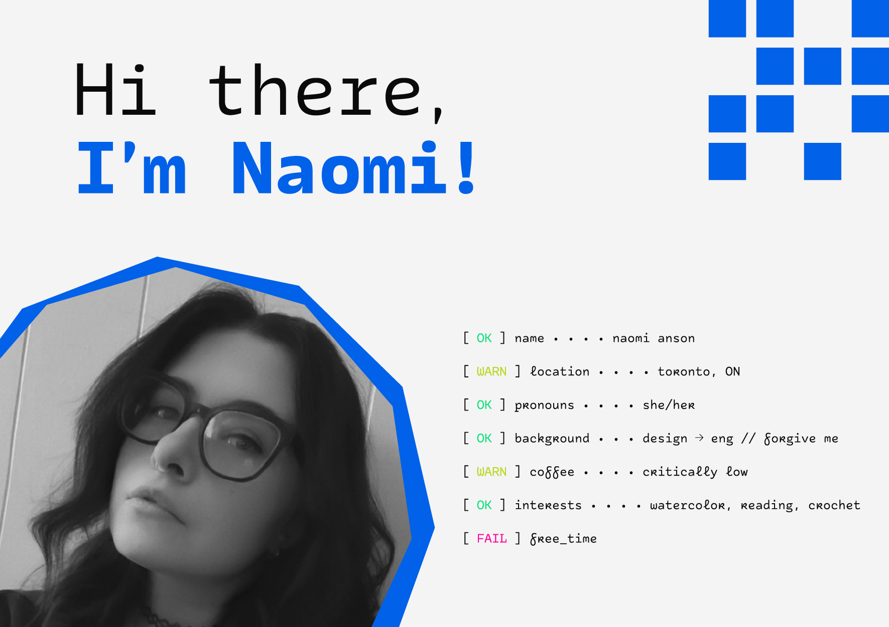
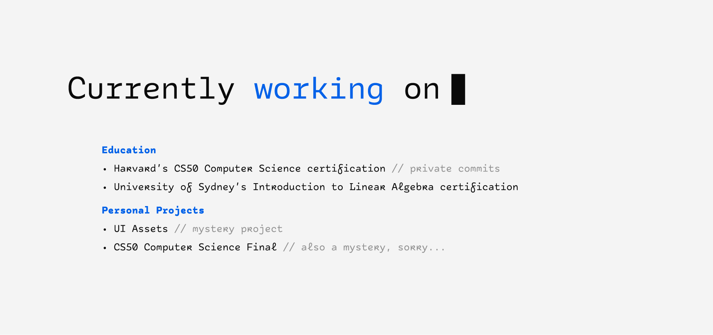
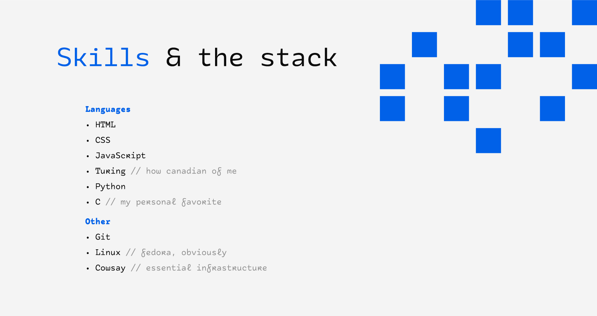

<picture>
  <source media="(prefers-color-scheme: dark)" srcset="about_dm.png">
  <source media="(prefers-color-scheme: light)" srcset="about_lm.png">
  
</picture>

 
 

<picture>
  <source media="(prefers-color-scheme: dark)" srcset="current_works_dm.png">
  <source media="(prefers-color-scheme: light)" srcset="current_works_lm.png">
  
</picture>

 
 

<picture>
 
  <source media="(prefers-color-scheme: dark)" srcset="https://github-readme-activity-graph.vercel.app/graph?username=naomianson&bg_color=0a0a0a&line=06e176&point=06e176&color=f4f4f4&area=true&area_color=06e176&custom_title=Naomi%27s%20GitHub%20Activity&hide_border=true">
  
  
  <source media="(prefers-color-scheme: light)" srcset="https://github-readme-activity-graph.vercel.app/graph?username=naomianson&bg_color=f4f4f4&line=0161e8&point=0161e8&color=0a0a0a&area=true&area_color=0161e8&custom_title=Naomi%27s%20GitHub%20Activity&hide_border=true">
  
  
  
</picture>

 
 

<picture>
  <source media="(prefers-color-scheme: dark)" srcset="stack_dm.png">
  <source media="(prefers-color-scheme: light)" srcset="stack_lm.png">
  
</picture>

 

<picture>
  <source media="(prefers-color-scheme: dark)" srcset="segfault_dm.png">
  <source media="(prefers-color-scheme: light)" srcset="segfault_lm.png">
  
</picture>
